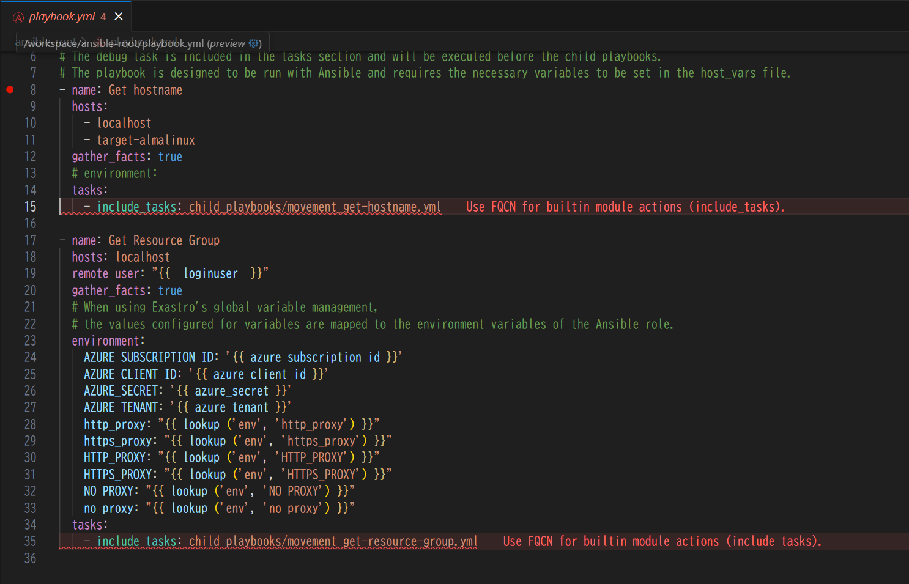
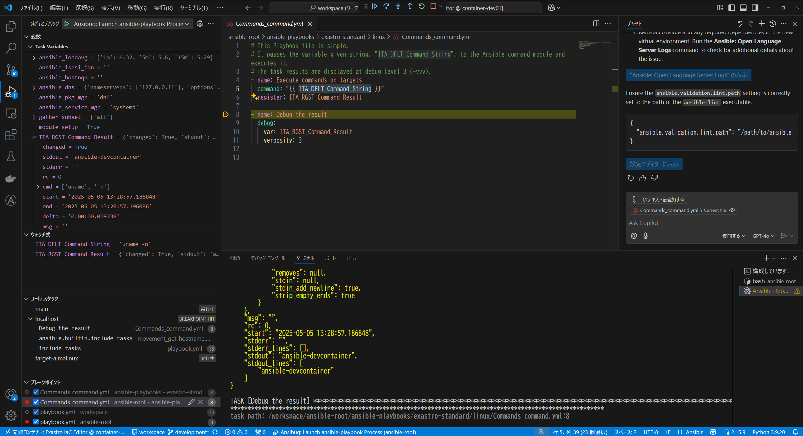
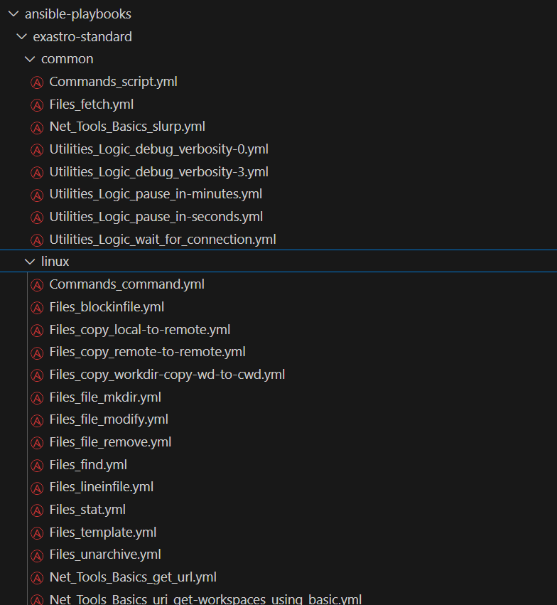
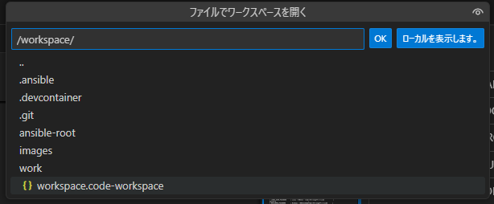
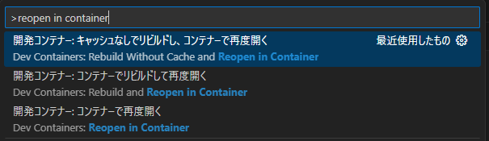
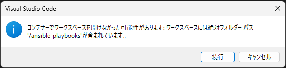
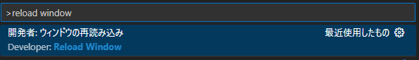

# Exastro IaC DevContainer

## 概要

Exastro IaC DevContainer は、Exastro に搭載する IaC のスムーズな開発を目的としており、IaC 開発環境のセットアップを効率的に行う開発プラットフォームです。
Exastro IaC DevContainer は、リモート開発環境として IaC の実行環境を提供するだけではなく、作業対象となる Linux ホスト(AlmaLinux)も含むオールインワン構成です。


## 主な機能

### Ansible playbook の開発に必要なリモートホスト構築や設定を自動的にセットアップ(DevContainer)


### 静的解析機能を利用することで高いコードの品質を維持(Ansible Lint)



### IaC のコーディングをステップ・バイ・ステップで実行(Ansibug)



### サンプルの Ansible playbook を使用して、すぐに開発を開始(Exastro IaC Samples)



## 前提条件

### ハードウェア要件(最小構成)

DevContainer の起動に必要なハードウェア要件は下記の通りとなります。

ただし、作業対象となるコンテナを起動するのに必要なリソースを確保してください。


|  種別 | | 要求リソース |
| ---------| --- | ------ |
| CPU      |    | 2Cores |
| メモリ   |    | 4GB    |
| ディスク容量 | DevContainer | 2GB   |
| | Target Linux | 2GB |
| | Target Windows | 10GB   |

### OSとソフトウェアの動作確認済みのバージョン

| OS            | podman                 | Docker Compose         | Docker                 |
| ------------- | ---------------------- | ---------------------- | ---------------------- |
| Almalinux 8.9 | -                         | -                              | Docker version 26.1.3 |

## セットアップ手順

1. 事前準備(コンテナ環境の構築)

   ```bash
   sh <(curl -sf https://ita.exastro.org/setup) install -i
   ```

1. リポジトリをクローン

   ```bash
   git clone https://github.com/exastro-suite/exastro-iac-devcontainer.git
   cd exastro-iac-devcontainer
   ```

2. 必要な環境変数を設定:

   サンプルから環境変数ファイルをコピーします。

   ```bash
   cd .devcontainer
   cp -pi .env.sample .env
   ```

   以下の環境変数を適宜 `.env`ファイルに設定してください。

   なお、__HOST_DOCKER_GID__ は、環境によって異なるため、必ず Docker の GID を指定してください。
   Docker ユーザー の GID は下記のコマンドから確認できます。

   ```bash
   grep docker /etc/group
   ```

   | 項目名                  | 説明                                              | デフォルト値                                      |
   |-------------------------|---------------------------------------------------|-------------------------------------------------|
   | ITA_VERSION             | 使用する Exastro IT Automation のバージョン。     | 2.5.4                                           |
   | GIT_REPO_URL            | 連携する IaC コードの Git リポジトリの URL。                   | https://github.com/exastro-suite/exastro-iac-samples.git |
   | GIT_REPO_LOCAL_DIR      | Git リポジトリのクローン先となるホストOS上のローカルディレクトリ。             | ansible-playbooks                               |
   | GIT_BRANCH              | 使用する Git リポジトリのブランチ。               | main                                            |
   | HOST_DOCKER_GID         | ホストマシン上の Docker グループの GID。          | 985                                             |
   | LINUX_ROOT_PASSWORD     | Linux マシンの root ユーザーのパスワード。        | P@ssw0rd                                       |
   | LINUX_USER_PASSWORD     | Linux マシンの一般ユーザーのパスワード。           | password                                        |
   | WIN_ADMIN_PASSWORD      | Windows マシンの管理者ユーザーのパスワード。      | P@ssw0rd                                       |

3. DevContainer を起動:
   VSCode でこのリポジトリのディレクトリを開き、Remote Containers機能を使用してDevContainerを起動します。
   次に、__ファイル__ > __ファイルでワークスペースを開く...__ から **workspace.code-workspace** を選択し、ワークスペースを開きます。

   

   `Shift + P` でコマンドパレットを開き、`reopen in container` と入力し、**開発コンテナー: コンテナーで再度開く** を選択します。

   

   下記のメッセージが出る場合は、**続行** ボタンを押下します。

   

   10～20分程度で開発コンテナのビルドが完了し、利用可能な状態になります。
   デバッガがうまく動作しない場合は、`Shift + P` でコマンドパレットを開き、`reload window` と入力し、***開発者: ウィンドウの再読み込み** を選択します。

   


## ディレクトリ構成

```
/workspace                                                  # 本ツールの root ディレクトリ
├── ansible-root                                         # Ansible 実行時の root ディレクトリ
│   ├── AnsibleExecOption.txt                           # Ansible 実行時のオプション設定ファイル
│   ├── ansible-playbooks -> ../../ansible-playbooks    # Ansible Playbook の格納場所。外部の IaC 管理リポジトリのフェッチ先
│   ├── child_playbooks                                 # 上記の Playbook と作業(Movement)の紐づけを管理する Playbook
│   │   ├── movement_get-hostname.yml                  # ホスト名を取得する Playbook のサンプル
│   │   └── movement_get-resource-group.yml            # Azure のリソースグループを取得する Playbook のサンプル
│   ├── context                                         # Ansible Builder 実行時のコンテキスト出力先
│   ├── copy_files
│   ├── ee-sample.yml                                   # Ansible EE の構成管理ファイル (Ansible Builder デバッグ時に利用)
│   ├── hosts                                           # 作業対象ホストの定義
│   ├── hosts.sample                                    # 作業対象ホスト(コンテナ)のサンプル定義
│   ├── host_vars                                       # 作業対象ホストの設定値定義
│   │   ├── localhost                                  # DevContainer の設定値定義
│   │   └── target-almalinux                           # ターゲットとなる AlmaLinux コンテナの設定値定義
│   ├── logs
│   ├── _parameter                                      # ITA 独自変数 __parameters_dir_for_epc__ で使用する
│   │                                                       作業ディレクトリで、収集機能（in）の「_parameters」のパス
│   ├── _parameters_file                                # ITA 独自変数 __parameters_file_dir_for_epc__ で使用する
│   │                                                       作業ディレクトリで、収集機能（in）の「_parameters」のパス
│   ├── playbook.yml                                    # Ansible 実行時のメインのP laybook
│   ├── template_files                                  # テンプレートファイル格納先
│   ├── upload_files                                    # アップロードファイル格納先
│   └── vault_password_file_path                        # Ansible Vault パスワードファイル(平文)
├── inventory.ini                                        # インベントリファイル
├── out                                                  # Ansible 実行時の一時領域
│   ├── conductor_workflowdir                           # ITA独自変数 __conductor_workflowdir__ のディレクトリ
│   ├── MOVEMENT_STATUS_FILE                            # ITA独自変数 __movement_status_filepath__ のファイルパス
│   ├── _parameter                                      # ITA 独自変数 __parameter_dir__ で使用する
│   │                                                       作業結果ディレクトリで、収集機能（out）の「_parameters」のパス
│   ├── _parameters_file                                # ITA 独自変数 __parameters_file_dir__ で使用する
│   │                                                       作業結果ディレクトリで、収集機能（out）の「_parameters」のパス
│   └── workflowdir                                     # ITA独自変数 __workflowdir__  のディレクトリ
└── workspace.code-workspace                             # 本ツールの VSCode ワークスペースの定義
```

## Exastro の設定項目とファイルの関係

| Exastro IT Automatoin | Exastro IaC DevContainer |
| --- | --- |
| 機器一覧 | ansible-root/hosts |
| グローバル変数管理 | ansible-root/playbook.yml 内の `environment` |
| Movement | ansible-root/playbook.yml 内の各プレイ |
| Playbook 素材 | ansible-root/ansible-playbooks/** |
| Movement-Playbook紐付 | ansible-root/child_playbooks/**.yml 内の `include_tasks` |
| 代入値管理 | ansible-root/host_vars/<ターゲットホスト名> |

## 注意事項

- 開発した IaC ファイルのコミット時にパスワードや認証トークンといった機微情報が含まれないように十分注意してください。
- 本ツールは、IaC のコーディング及び単体テスト、デバッグを目的をしているため、実際の機器での実行結果と異なる場合があるため、必ず Exastroシステムとの結合テストを別途行ってください。
- `post_create.sh` スクリプトは、指定されたGitリポジトリをクローンし、Ansible Playbookのベース資材を準備します。

## ライセンス

このプロジェクトは Apache License Version 2.0 の下で提供されています。

## コントリビューション

バグ報告や機能提案は、Issueを通じて受け付けています。プルリクエストも歓迎します。

## 参考リンク

- [Ansible公式ドキュメント](https://docs.ansible.com/)
- [Exastro公式サイト](https://www.exastro.org/)
